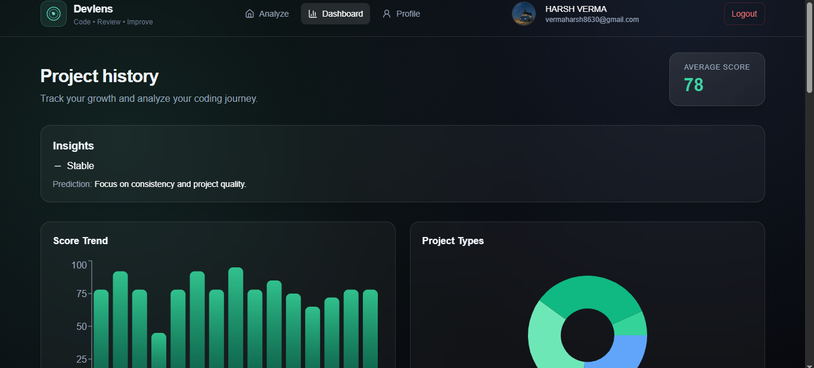
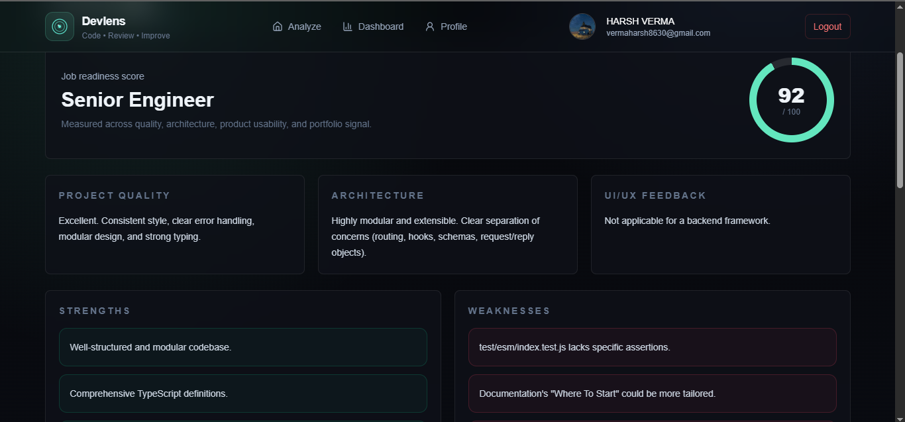
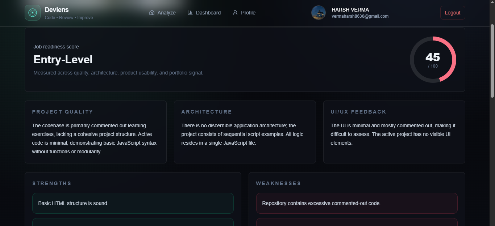
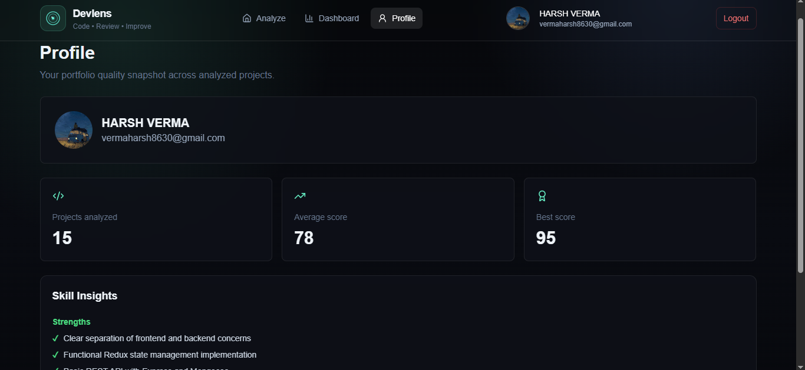

# Devlens 🚀

## Dashboard



## GitHub Analysis



## Upload Analysis



## Profile




# Project Insight AI

Project Insight AI is a production-ready SaaS starter that evaluates whole software projects as products, not just snippets of code. It analyzes GitHub repositories or uploaded project files and returns code quality feedback, architecture guidance, UI/UX notes, an improvement roadmap, and a job-readiness score.

## Stack

- Frontend: React, Vite, Tailwind CSS, Framer Motion, Firebase Auth
- Backend: Node.js, Express, MongoDB, GitHub API
- AI: OpenAI-compatible JSON response with a deterministic local fallback

## Quick Start

```bash
npm run install:all
cp server/.env.example server/.env
cp client/.env.example client/.env
npm run dev
```

Client: `http://localhost:5173`

API: `http://localhost:5000`

## Required Environment

Set `MONGODB_URI` in `server/.env`.

For real AI analysis, set `AI_PROVIDER=gemini` and `GEMINI_API_KEY`, or set `AI_PROVIDER=openai` and `OPENAI_API_KEY`. Without an AI key, the backend returns structured heuristic analysis so development still works.

For auth, add Firebase web config values to `client/.env`. Backend Firebase Admin verification is optional in local development; add service account values in `server/.env` for stricter token verification.

## API

- `POST /api/analyze-project` with `{ "githubUrl": "https://github.com/owner/repo" }`
- `POST /api/analyze-upload` as multipart form-data with `files`
- `GET /api/ai-status` checks whether the configured AI provider is responding
- `GET /api/projects`
- `GET /api/project/:id`

## Notes

The repository extraction layer filters important source files, ignores generated/vendor folders, caps per-file size, and caps total prompt size before sending code context to the AI engine.
